# 📝 **Rapport de TP – Robotique Mobile (TP1)**

**Étudiant :** Abdelali ichou
**Groupe :** Group1, M2 ILA
**Date :** 01-12-2025

---

# **1. Assemblage du robot**

### ✔️ Objectif

Assembler le robot mobile à partir des composants fournis : M5StickC Plus, RoverC, servomoteur, capteurs ToF, couleur, ultrasons, LEGO, câbles Grove.

### ✔️ Description

Le robot a été assemblé en suivant le livret fourni sur Moodle.
Tous les modules ont été connectés à l’aide des ports Grove conformément aux instructions.

### 📸 *Photo de mon robot assemblé*

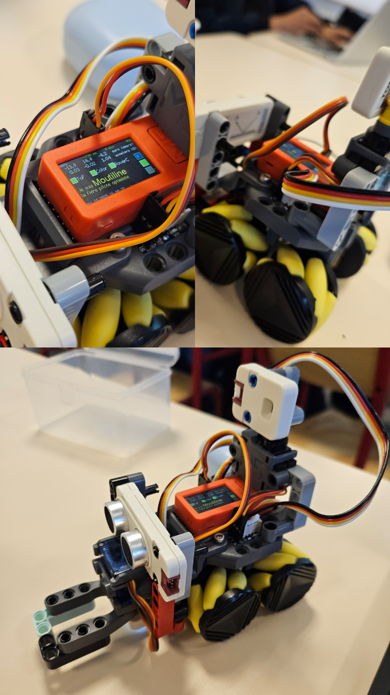

---

# **2. Mise en route du robot**

### ✔️ Allumage

* M5StickC Plus activé via le bouton arrière-gauche
  
### ✔️ Connexion WiFi

* Réseau : `ROBM_Moulitine`
* Mot de passe : `WALL-E!SuzanCalvin`

---

# **3. Utilisation de Pixi ROS2**

### ✔️ Démarrage de l’environnement ROS

```
pixi shell
```

### ✔️ Lancement du pont UDP

```
pixi run udp_bridge
```

Cette commande active la communication entre le robot et ROS2.

### 📸 *Capture d’écran : communication avec le robot*

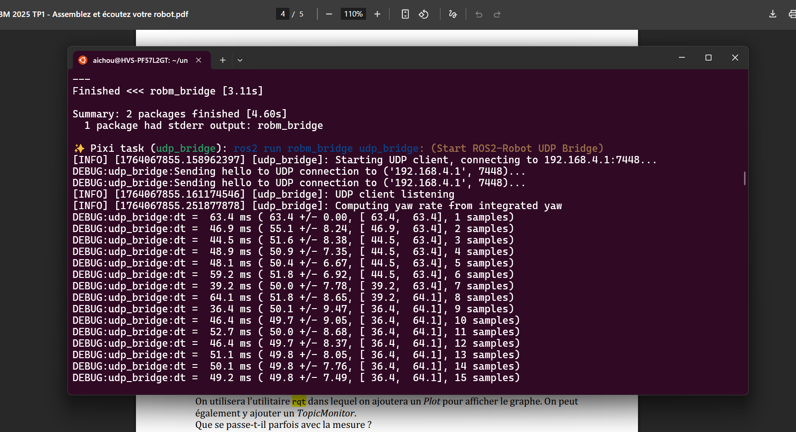

---

# **4. Exploration des topics ROS2**

### ✔️ Liste des topics ROS2

Commande utilisée :

```
ros2 topic list
```

### 📸 *Capture d’écran : liste des topics*


---

# **5. Lecture des données des capteurs**

## **5.1 Capteur ToF (distance)**

### ✔️ Lecture des données

```
ros2 topic echo /tof
```

### 📸 *Capture d’écran : capture du distance*

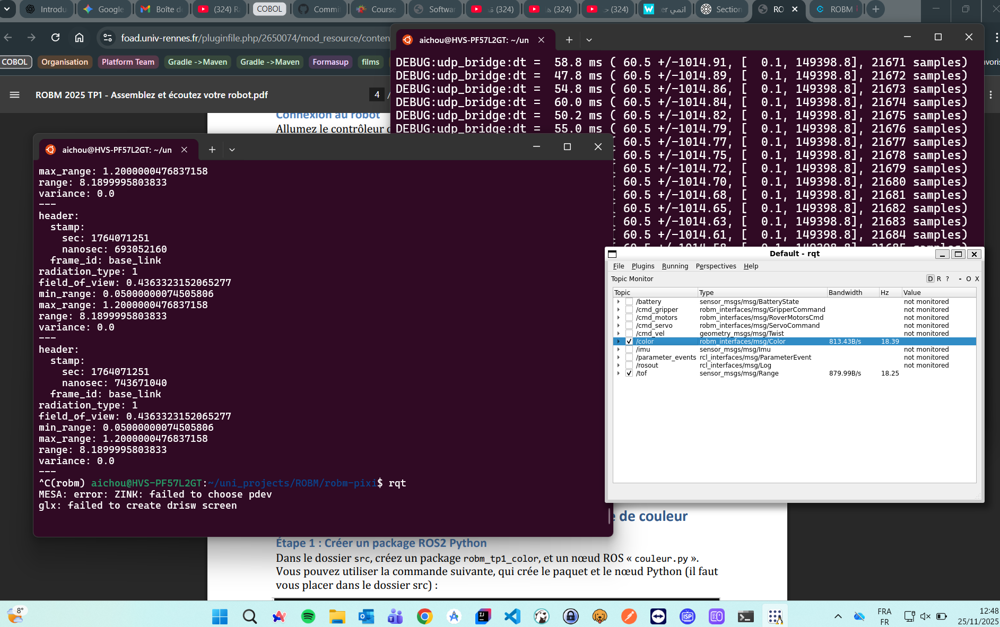

### **Question : Que se passe-t-il parfois avec les mesures ?**

**Réponse :**
Le capteur ToF renvoie parfois des valeurs incorrectes (0, très grandes valeurs).
Cela se produit lorsque :

* l’objet est trop loin
* le capteur est trop proche de l’objet

### 📈 Affichage dans *rqt*

* Ajout d’un onglet `Plugins/visualization/plot`
* Ajout d’un `topic/range`

### 📸 *Capture d’écran du graphe ToF dans rqt GUI*


---

## **5.2 Capteur Couleur**

### ✔️ Lecture des données

```
ros2 topic echo /color
```

### **Question : Quelles valeurs pour différents sols ?**

Voici mes mesures :

| Type de sol | R | G | B | Luminosité |
| ----------- | - | - | - | ---------- |
| Bleu        | 1 | 13| 59|     37     |
| Green       | 6 | 32| 12|     210    |
| Rouge       | 51| 6 | 8 |     50     |

### 📸 *Capture d’écran du Rouge*

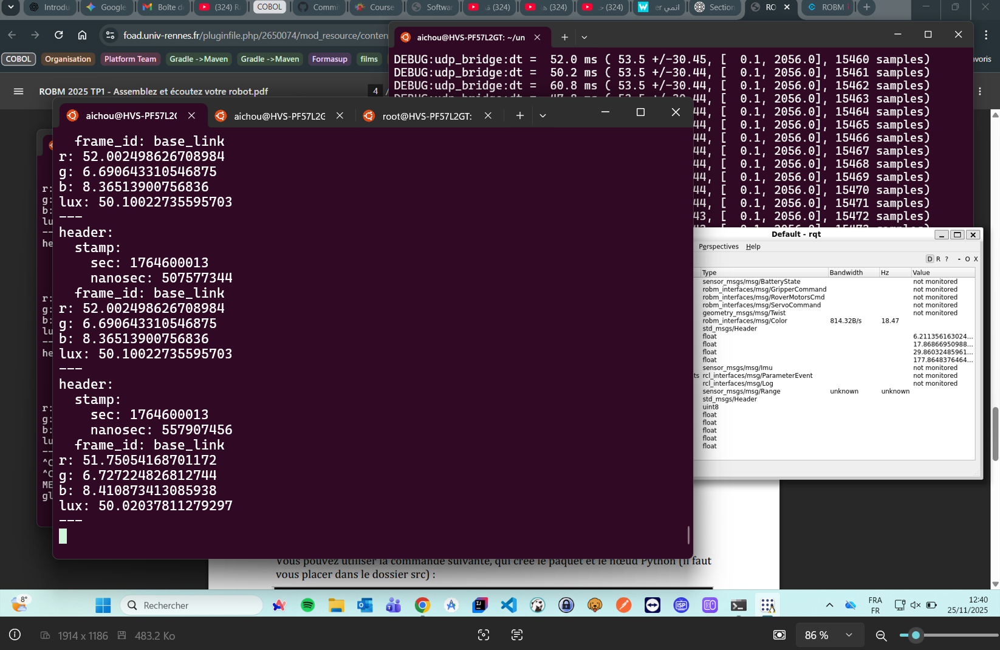


### 📸 *Capture d’écran du Blue*

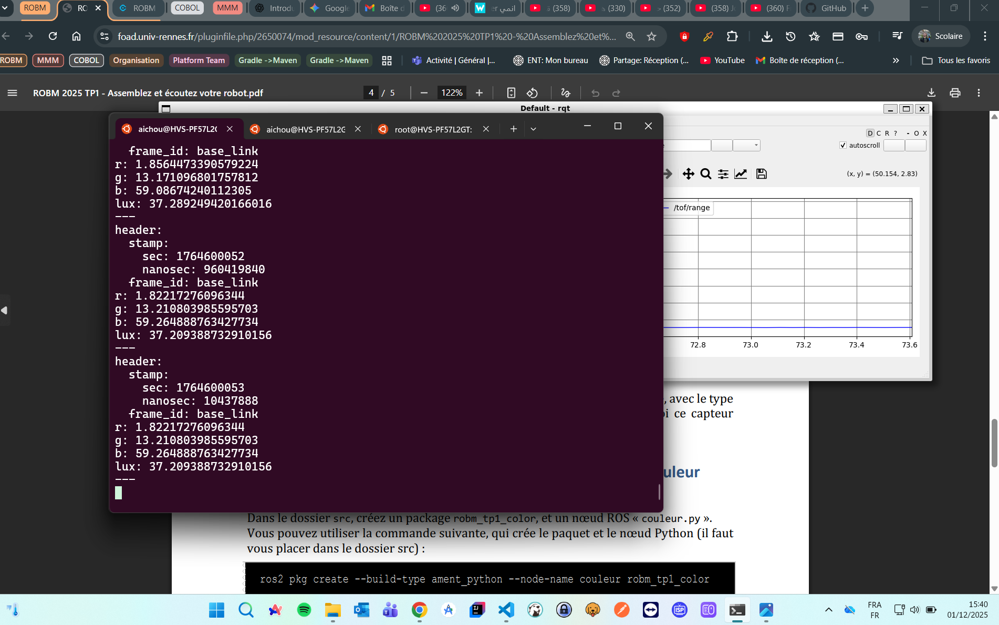


### 📸 *Capture d’écran du Green*


### **Question : À quoi sert ce capteur ?**

**Réponse :**

* Reconnaissance de surfaces
* Détection de zones colorées

---

# **6. Développement d’un nœud ROS2 : Détection de couleur**

## **6.1 Création du package**

Commande utilisée :

```
cd src
```
```
ros2 pkg create --build-type ament_python --node-name couleur robm_tp1_color
```
```
cd ..
```
```
colcon build or pixi run build
```
```
source install/setup.bash
```

### 📸 *Capture de l’arborescence du package*

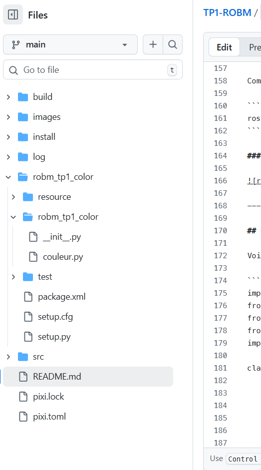

---

## **6.2 Code du nœud : abonnement au capteur couleur**

Voici le code utilisé :

```python
import rclpy
from rclpy.node import Node
from robm_interfaces.msg import Color
from std_msgs.msg import String
import numpy as np

class ColorDetector(Node):
    def __init__(self):
        super().__init__('couleur')

        self.subscription = self.create_subscription(
            Color,
            'color',
            self.callback_color,
            10
        )

        self.publisher = self.create_publisher(String, 'nom_couleur', 10)

        # Valeurs des couleurs mesurées auparavant
        self.known_colors = {
            "blanc": np.array([200, 200, 200]),
            "noir":  np.array([10, 10, 10]),
            "rouge": np.array([180, 40, 30]),
            "vert":  np.array([40, 180, 40]),
            "bleu":  np.array([30, 40, 180])
        }

    def callback_color(self, msg):
        current = np.array([msg.r, msg.g, msg.b])

        distances = {name: np.linalg.norm(current - ref)
                     for name, ref in self.known_colors.items()}

        detected = min(distances, key=distances.get)

        msg_out = String()
        msg_out.data = detected
        self.publisher.publish(msg_out)

        self.get_logger().info(f"Couleur détectée : {detected}")

def main(args=None):
    rclpy.init(args=args)
    node = ColorDetector()
    rclpy.spin(node)
    node.destroy_node()
    rclpy.shutdown()
```

---

## **6.3 Test du nœud**

### ✔️ Lancement

```
pixi shell
```
```
cd ~/uni_projects/ROBM/robm-pixi
```
```
colcon build or pixi run build
```
```
source install/setup.bash
```
```
ros2 run robm_tp1_color couleur
```

### ✔️ Observation du topic :

```
ros2 topic echo /nom_couleur
```

### 📸 *Capture : topic nom_couleur*

```

```

---

# **7. Visualisation du réseau ROS : rqt_graph**

```
rqt_graph
```

Le schéma attendu :

```
/color  --->  /couleur  --->  /nom_couleur
```

### 📸 *Capture d’écran du graphe ROS2*

```

```

---

# **8. Problèmes rencontrés**

* difficultés de connexion WiFi
* erreur Python dans le package (ex : rclpy)
* capteur ToF instable
* problème avec rqt qui ne rafraîchit pas & très lent

---

# **9. Conclusion**

Ce TP m’a permis de :

* comprendre & manipuler ROS2 (topics, publishers, subscribers)
* utiliser *rqt* pour visualiser des données
* développer un nœud ROS2 fonctionnel de détection de couleur
* publier un message personnalisé sur un topic

# 📝 Notes: 

### Démarrage de l’environnement ROS

```
pixi shell
```

### Lancement du bridge UDP avec le robot

**You need to be inside shell**

```
pixi shell
```
```
ros2 run robm_bridge udp_bridge
```

### Show all avaible topics with the robot

```
ros2 topic list
```

### Read data from a topic

```
ros2 topic echo /topic
```
```
ros2 topic echo /color
```
```
ros2 topic echo /tof
```

### Creating new topic package

```
cd src (obligatory, so it will be created along side with the robm_interfaces)
```
```
ros2 pkg create --build-type ament_python --node-name Python_noeud_file Topic_package_name
```
```
cd ..
```
```
colcon build or pixi run build
```
```
source install/setup.bash
```

### Inside our Python_noeud_file, we susbsribe to the color topic to receive color data from the robot

```
self.subscription = self.create_subscription(
    Color,
    'color',
    self.color_callback,
    10
)
```

### Publish the real time sensor color to a topic

```
self.publisher = self.create_publisher(String, 'topic_name', 10)
```
```
self.publisher.publish("message")
```

### Running the Python_noeud_file in terminal N1

```
pixi shell
```
```
cd ~/uni_projects/ROBM/robm-pixi
```
```
colcon build or pixi run build
```
```
source install/setup.bash
```
```
ros2 run Topic_package_name Python_noeud_file
```

### Consuming the Python_noeud_file topic in terminal N2

if we show all the topics, we will se the one created by the package we runned in the previous command
```
ros2 topic list
```

We consume this previous created topic
```
pixi shell
```
```
cd ~/uni_projects/ROBM/robm-pixi
```
```
ros2 topic echo /topic_name
```


---

# 📝 **Rapport de TP – Robotique Mobile (TP2)**

**Étudiant :** Abdelali ichou
**Groupe :** Group1, M2 ILA
**Date :** 01-12-2025

---

### Configuration du réparation

Mettre à jour le sous-module ROS Pixi
```
cd pixi home
```
```
git submodule update --init --recursive --remote
```

Installer teleop_tools (pour contrôler avec clavier/souris) :
```
cd <home>/src
```
```
git clone https://github.com/ros-teleop/teleop_tools.git
```
```
cd ..
```
```
pixi shell
```
```
colcon build or pixi run build
```
```
source install/setup.bash
```

Connexion au robot dans un autre terminal :
```
pixi shell
```
```
ros2 run robm_bridge udp_bridge
```

### Créer le package ROS2 pour le TP2

```
cd <home>/src
```

Créer le package Python
```
ros2 pkg create --build-type ament_python --node-name avance_motor robm_tp2_move
```
```
cd ..
```
```
pixi shell
```
```
colcon build or pixi run build
```
```
source install/setup.bash
```

### Comprendre le message de commande des moteurs

Topic : `cmd_motors`

Type : `robm_interfaces/msg/RoverMotorsCmd`

| Champ       | Signification         | Valeur |
| ----------- | --------------------- | ------ |
| front_left  | moteur avant gauche   | -1 à 1 |
| front_right | moteur avant droit    | -1 à 1 |
| rear_left   | moteur arrière gauche | -1 à 1 |
| rear_right  | moteur arrière droit  | -1 à 1 |

`-1` → plein arrière, `1` → plein avant

Contrôle PWM → il faut envoyer les commandes régulièrement pour maintenir le mouvement

### Code de nœud Python : avance_motor.py

```
import rclpy
from rclpy.node import Node
from robm_interfaces.msg import RoverMotorsCmd

class AvanceMotor(Node):
    def __init__(self):
        super().__init__('avance_motor')

        # Publisher vers cmd_motors
        self.publisher = self.create_publisher(RoverMotorsCmd, 'cmd_motors', 10)

        # Timer à 10 Hz
        self.counter = 0
        self.max_count = 20  # 20 messages → 2 secondes
        self.timer = self.create_timer(0.1, self.timer_callback)  # 0.1s = 10Hz

    def timer_callback(self):
        if self.counter < self.max_count:
            msg = RoverMotorsCmd()
            # Déplacement avant : tous moteurs à +0.5
            msg.front_left = 0.5
            msg.front_right = 0.5
            msg.rear_left = 0.5
            msg.rear_right = 0.5

            self.publisher.publish(msg)
            self.get_logger().info(f"Commande moteur envoyée ({self.counter+1}/{self.max_count})")
            self.counter += 1
        else:
            # Stop le robot après 2 secondes
            msg = RoverMotorsCmd()
            msg.front_left = 0.0
            msg.front_right = 0.0
            msg.rear_left = 0.0
            msg.rear_right = 0.0
            self.publisher.publish(msg)
            self.get_logger().info("Arrêt du robot.")
            self.timer.cancel()

def main(args=None):
    rclpy.init(args=args)
    node = AvanceMotor()
    rclpy.spin(node)
    node.destroy_node()
    rclpy.shutdown()

if __name__ == '__main__':
    main()
```

### Test du nœud

Lancer udp_bridge dans un terminal1
```
pixi shell
```
```
ros2 run robm_tp2_move avance_motor
```

Visualiser le réseau ROS2
```
rqt_graph
```

### Créer d’autres mouvements

Tourne sur place : `tourne_motor.py`
```
msg.front_left = -0.5
msg.front_right = 0.5
msg.rear_left = -0.5
msg.rear_right = 0.5
```

Tourner à gauche : `gauche_motor.py`
```
msg.front_left = -0.5
msg.front_right = 0.5
msg.rear_left = 0.5
msg.rear_right = -0.5
```

Tourner à droit : `droit_motor.py`
```
msg.front_left = 0.5
msg.front_right = -0.5
msg.rear_left = -0.5
msg.rear_right = 0.5
```

Marche arrière : `back_motor.py`
```
msg.front_left = -1.0
msg.front_right = -1.0
msg.rear_left = -1.0
msg.rear_right = -1.0
```

Marche avant : `avance_motor.py`
```
msg.front_left = 0.5
msg.front_right = 0.5
msg.rear_left = 0.5
msg.rear_right = 0.5
```

Inside setup.py we add the shell commands
```
 entry_points={
      'console_scripts': [
          'avance_motor = robm_tp2_move.avance_motor:main',
          'gauche_motor = robm_tp2_move.gauche_motor:main',
          'tourne_motor = robm_tp2_move.tourne_motor:main',
          'back_motor = robm_tp2_move.back_motor:main',
          'droit_motor = robm_tp2_move.droit_motor:main',
      ],
  },
```

Maintenant, tu peux lancer tes trois nœuds avec :
```
ros2 run robm_tp2_move avance_motor
```
### 📸 *Capture d’écran du Robot avance*

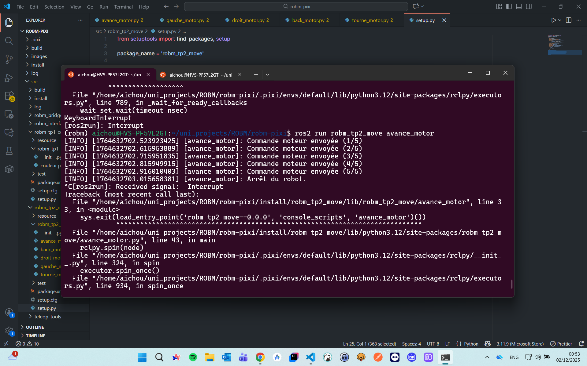

```
ros2 run robm_tp2_move back_motor
```
### 📸 *Capture d’écran du Robot back*

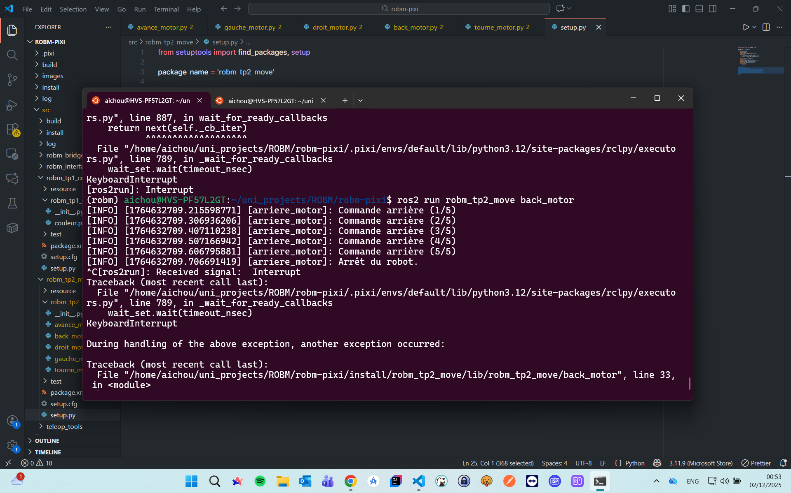

```
ros2 run robm_tp2_move droit_motor
```
### 📸 *Capture d’écran du Robot droit*

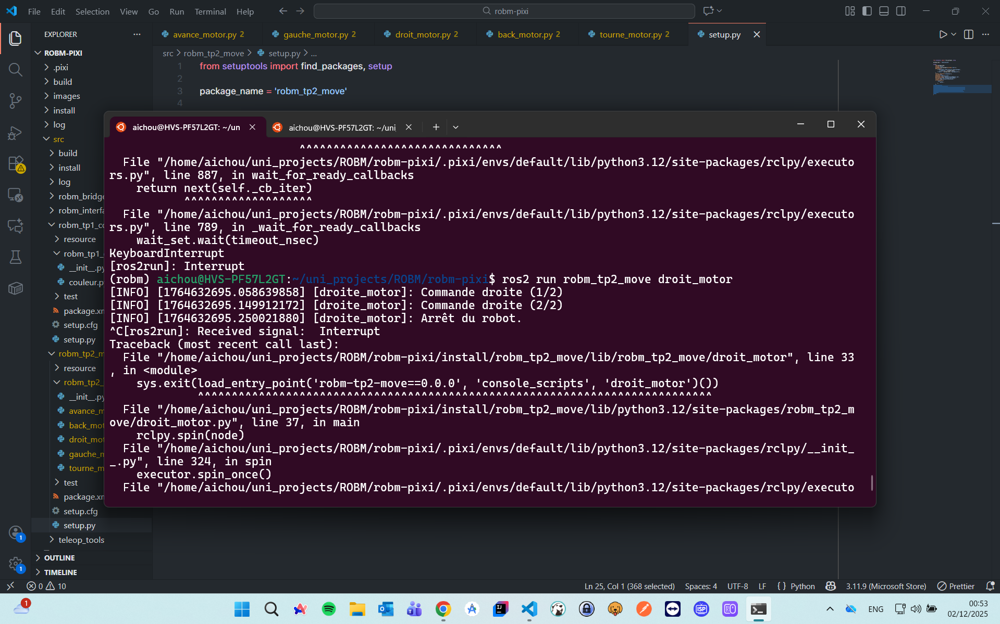

```
ros2 run robm_tp2_move gauche_motor
```
### 📸 *Capture d’écran du Robot gauche*

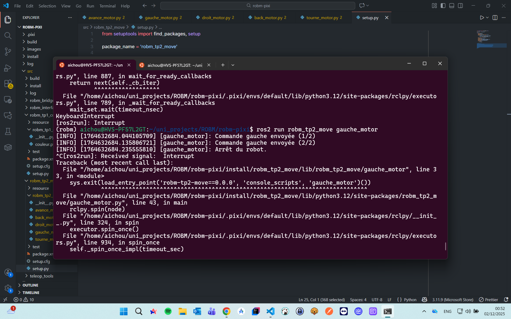

```
ros2 run robm_tp2_move tourne_motor
```
### 📸 *Capture d’écran du Robot tourne*

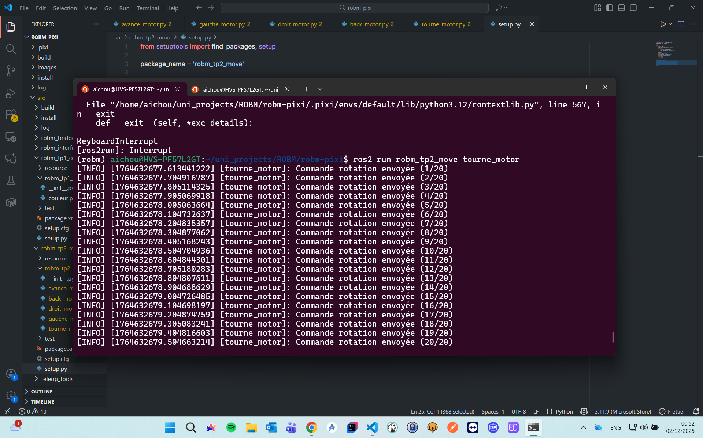


### Move robot with keyboard

create the new movement python node
```
import rclpy
from rclpy.node import Node
from geometry_msgs.msg import TwistStamped
from robm_interfaces.msg import RoverMotorsCmd

class VelToMotor(Node):
    """Converts TwistStamped messages into individual motor commands."""

    def __init__(self):
        super().__init__('vel_to_motor')
        self.get_logger().info("Node started: converting velocities to motor commands.")

        # Subscriber to cmd_vel or any TwistStamped topic
        self.sub = self.create_subscription(
            TwistStamped,
            'vel',  # topic to subscribe to (you can remap key_teleop output)
            self.vel_callback,
            10
        )

        # Publisher to cmd_motors
        self.pub = self.create_publisher(RoverMotorsCmd, 'cmd_motors', 10)

    def vel_callback(self, msg: TwistStamped):
        """Convert linear and angular velocities to motor commands."""
        # Extract velocities
        vx = msg.twist.linear.x      # forward/back
        vy = msg.twist.linear.y      # left/right
        wz = msg.twist.angular.z     # rotation

        # Compute each wheel command for Mecanum robot
        motor_cmd = RoverMotorsCmd()
        motor_cmd.front_left  = vx - vy - wz
        motor_cmd.front_right = vx + vy + wz
        motor_cmd.rear_left   = vx + vy - wz
        motor_cmd.rear_right  = vx - vy + wz

        # Ensure values are within [-1, 1] for motor driver
        motor_cmd.front_left  = max(-1.0, min(1.0, motor_cmd.front_left))
        motor_cmd.front_right = max(-1.0, min(1.0, motor_cmd.front_right))
        motor_cmd.rear_left   = max(-1.0, min(1.0, motor_cmd.rear_left))
        motor_cmd.rear_right  = max(-1.0, min(1.0, motor_cmd.rear_right))

        # Publish motor command
        self.pub.publish(motor_cmd)
        self.get_logger().info(
            f"Motors cmd | FL:{motor_cmd.front_left:.2f} FR:{motor_cmd.front_right:.2f} "
            f"RL:{motor_cmd.rear_left:.2f} RR:{motor_cmd.rear_right:.2f}"
        )


def main(args=None):
    rclpy.init(args=args)
    node = VelToMotor()
    rclpy.spin(node)
    node.destroy_node()
    rclpy.shutdown()


if __name__ == "__main__":
    main()
```

in the first terminal
```
ros2 run robm_tp2_move dynamic_motor
```


in the second terminal
```
 ros2 run key_teleop key_teleop --ros-args -p rotation_rate:=0.5 -r key_vel:=vel
```


